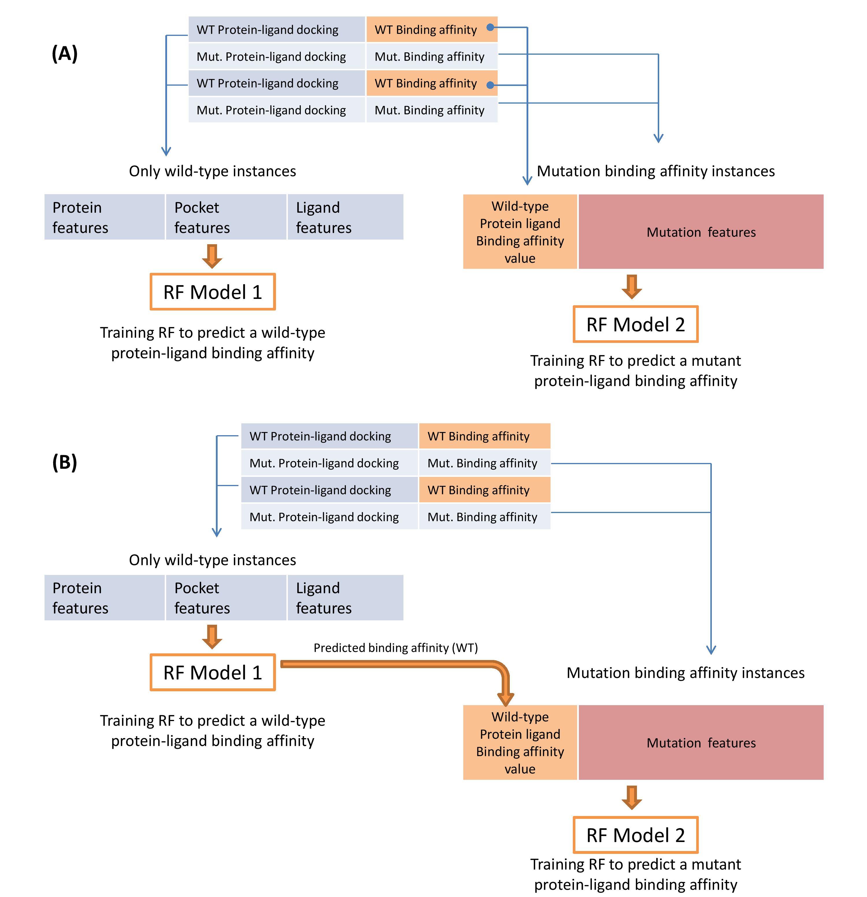

# PSnpBind-ML: A machine learning approach to predict the binding pocket SNP's effects on protein-ligand binding affinity

[](https://mybinder.org/v2/gh/ammar257ammar/PSnpBind-ML/ccde6b4f84f9d1b9425b3fc271ddf72f91dca17c)

Protein mutations, especially the ones occurring in the binding site, play an important role in inter-individual drug response and may alter binding affinity and thus impact the drug's efficacy and side effects. Unfortunately, large-scale experimental screening of ligand-binding against protein variants is still unavailable due to the time-consuming and expensive experimental costs. Alternatively, in silico approaches like machine learning can play a pioneering role in guiding those experiments. In fact, many methods have been applied from computationally cheaper machine learning (ML) models to the more expensive molecular dynamics methods to accurately predict the mutation effects. However, these effects have been studied on mostly limited and small datasets while, ideally, a large dataset of binding affinity changes due to binding site mutations is needed. In this work, we used the PSnpBind database to train a machine learning model predicting protein-ligand binding affinity and the effect of binding site single point mutations on it. Numerical representation of protein, pocket, mutation, and ligand information was encoded using 256 features among which about half of them were manually crafted based on domain knowledge. A machine learning approach composed of two regression models was proposed, the first predicting wild-type protein-ligand binding affinity while the second predicting the mutated protein-ligand binding affinity. The best performance model reported an RMSE value within 0.5-0.6 kcal/mol<sup>-1</sup> on an independent test set with an R<sup>2</sup> value of 0.87-0.89 and a prediction speed of 0.1 ms per instance. We report an improvement in the prediction performance compared to several reported models developed for protein-ligand binding affinity prediction. The obtained models can be used as a complementary method in early-stage drug discovery. They can be applied to rapidly obtain a better overview of the ligand binding affinity changes across protein variants carried by people in the population and narrow down the search space where more time-demanding methods can be used to identify potential leads that achieve a better affinity overall protein variants.

## Model Design
[](images/model-design/model-design-2.png)

## Usage
The whole code is reproducible via MyBinder. You can just launch an instance of Jypyter lab populated with the files in the repository and start running the notebooks.
This can be done via the button: 
[](https://mybinder.org/v2/gh/ammar257ammar/PSnpBind-ML/ccde6b4f84f9d1b9425b3fc271ddf72f91dca17c)

Otherwise, you can launch an instance of Jupyter lab on your local machine or server using the following command

```sh
docker run -it --name rb --rm -p 8888:8888 -v PATH_TO_THIS_REPO_ON_YOUR_MACHINE:/home/jovyan/work jupyter/r-notebook:r-4.1.1
```

After starting Jupyter lab, you can start running the code by following the numbered notebooks in this repository as follows:

| Notebook  | Description |
|---|---|
| 01-R-dataset-prepare-and-viz.ipynb  |  Create data splits and generate plots for molecular properties |
| 02-py-data-split-by-ligand-diversity.ipynb  | Create ligand similarity-based data split using RDKit sphere exclusion algorithm  |
| 03-R-y-randomization-prepare.ipynb  | Create the y-randomization datasets |
| 04-py-ml-modeling.ipynb | Perform ML training validation, feature importance plots, and Y-randomization evaluation |
| 05-R-ml-results-viz.ipynb | Visualization plots of the ML models training/testing |

## Data Availability
- PSnpBind data is available on Zenodo: [https://doi.org/10.5281/zenodo.6968470](https://doi.org/10.5281/zenodo.6968470)
- PSnpBind-ML pretrained models are available on Zenodo: [https://doi.org/10.5281/zenodo.6968470](https://doi.org/10.5281/zenodo.6968470)

## Citation
